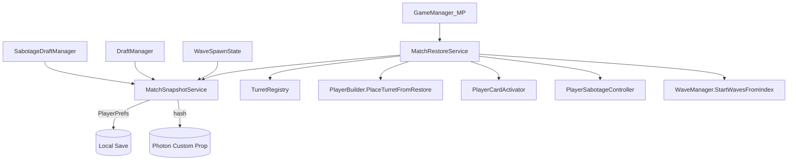
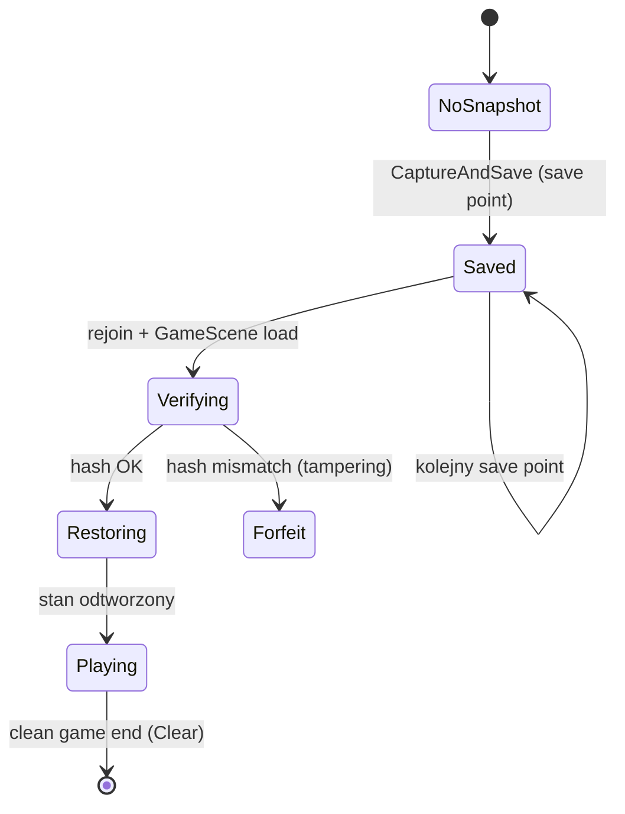
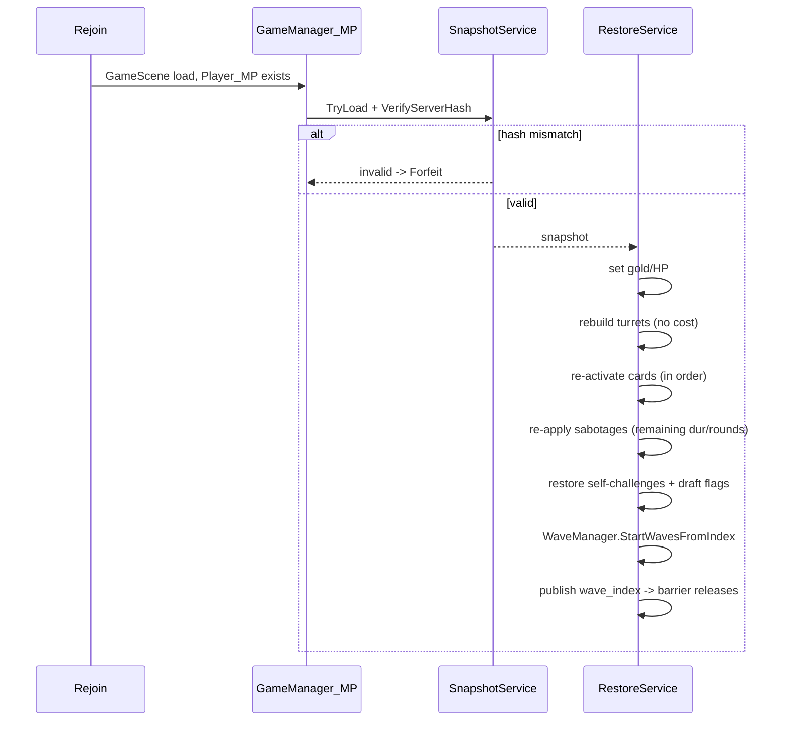

# Design — Match State Reconnect Sync

## Overview

Po rozłączeniu (network blip, restart aplikacji, reboot PC) gracz wraca do meczu
i **wznawia grę od początku rundy, w której był**, zamiast zaczynać od zera.
Drugi gracz w tym czasie czeka na istniejącej barierze synchronizacji fal.

Obecny system reconnectu przywraca gracza do pokoju Photona, ale **ładuje scenę
od nowa bez odtworzenia stanu gry** (fala, złoto, HP, wieże, karty, sabotaże).
Ten dokument opisuje system snapshot/restore, który tę lukę zamyka.

### Założenia (stan obecny)

- Gra to **parallel arena**: każdy gracz ma własną arenę i własny `WaveManager`.
  Wrogowie i wieże są lokalne (`Instantiate`, NIE `PhotonNetwork.Instantiate`).
- Przez sieć leci tylko: HP (RPC), śmierć, draft, sabotaż, lifecycle meczu.
- Synchronizacja rund działa przez barierę w `WaveSpawnState`:
  każdy kończy falę, ustawia `wave_{i}_complete` w Player Custom Properties,
  i czeka aż przeciwnik zrobi to samo.
- Reconnect: `PlayerTtl`/`EmptyRoomTtl = 90000 ms`, marker w `PendingMatchState`
  (PlayerPrefs per-konto PlayFab), rejoin przez `RejoinRoom`,
  `MatchOpponentWatcher` obsługuje rozłączenie przeciwnika.

## Architecture

### Decyzje projektowe (ustalone z użytkownikiem)

**1. Model snapshotu — zapisujemy "fakty", nie wyliczenia.**
Wartości pochodne (statystyki wież, mnożniki `PlayerModifierStack`, aury)
NIE są zapisywane — odbudowują się deterministycznie po ponownej aktywacji
kart i sabotaży. Zapisujemy tylko dane źródłowe.

**2. Magazyn — PlayerPrefs lokalnie (primary).**
Wzorowane na `PendingMatchState` (namespace per-konto PlayFab).
Przeżywa reboot PC, brak limitu rozmiaru, zero latencji. Snapshot i tak jest
potrzebny tylko temu samemu graczowi na tej samej maszynie.
Ograniczenie (akceptowane): reconnect z innej maszyny nie odtworzy stanu.

**3. Anti-tamper (warstwowo).**
- *Warstwa 1 — szyfrowanie + HMAC:* snapshot to zaszyfrowany blob z podpisem
  z sekretnego klucza w binarce. Zatrzymuje edycję PlayerPrefs "na notatnik".
  UCZCIWIE: klucz da się wyciągnąć z dekompilowanego klienta — to podniesienie
  poprzeczki, nie mur.
- *Warstwa 2 (mocna) — świadek na serwerze Photon:* przy każdym zapisie liczymy
  hash snapshotu i zapisujemy do Player Custom Property (mały, server-witnessed).
  Po reconnect porównujemy hash lokalny z serwerowym. Niezgodność = tampering =
  **przegrana**. Zamyka realny scenariusz: edycja offline'owego pliku gdy gracz
  jest nieaktywny (nie może wtedy zmienić hasha na serwerze).
- *Warstwa 3 — walidacja wartości sieciowych:* HP i indeks fali porównujemy
  z tym, co Photon zaobserwował. Złoto i wieże są lokalne, więc tej walidacji
  nie przejdą — to granica bez serwera autorytatywnego.

**4. Momenty zapisu — po KAŻDEJ zatwierdzonej decyzji widocznej w sieci.**
Nie tylko na granicy fali. Save pointy: (a) po wyborze karty z draftu,
(b) po wyborze sabotażu, (c) na starcie fazy spawn/combat (nowy indeks fali).
Powód: bez tego gracz rozłączony po wysłaniu RPC sabotażu, po powrocie
wybrałby sabotaż drugi raz → desync. `RPC_PlayerSelectedSabotage` jest
`AllBuffered`, więc Photon re-dostarcza bufor po rejoinie — restore MUSI być
idempotentny.

**5. Refactor bariery fal — pojedynczy licznik `wave_index`.**
Zamiast kumulujących się `wave_{i}_complete` (nigdy nie czyszczone, psują
reconnect) → jedna liczba `wave_index` w Player Custom Property. Wracający gracz
re-publikuje swój `wave_index`. Dodatkowo **timeout bariery** zintegrowany
z `MatchOpponentWatcher`.

**6. Idempotencja sabotaży.** Re-aplikacja przy restore nie może podwoić efektów
ubocznych — patrz Error Handling i Correctness Properties.

**7. Rozwiązywanie SO po nazwie — `TurretRegistry`.**
Karty/sabotaże ładują się z `Resources`. `TurretData` leży poza `Resources`,
więc wprowadzamy ScriptableObject lookup `name -> TurretData`.

**8. Bug do naprawienia.** `ReconnectPromptController.gameSceneName = "SampleScene"`
vs `NetworkManager.gameSceneName = "GameScene"` — ujednolicić.

### Diagram komponentów


### Cykl życia snapshotu


### Restore (sekwencja)


## Components and Interfaces

### Nowe komponenty

- **`MatchSnapshotService`** — buduje `PlayerMatchSnapshot` z żywej sceny,
  serializuje (JsonUtility), szyfruje + HMAC, zapisuje do PlayerPrefs
  (namespace per-konto), publikuje hash do Photon Custom Property.
  - `void CaptureAndSave()`
  - `bool TryLoad(out PlayerMatchSnapshot snap)`
  - `bool VerifyServerHash(PlayerMatchSnapshot snap)`
  - `void Clear()`
- **`MatchRestoreService`** — odtwarza stan po rejoinie.
  - `IEnumerator Restore(PlayerMatchSnapshot snap)`
- **`TurretRegistry`** (ScriptableObject) — `TurretData Resolve(string name)`.
- **`SnapshotCrypto`** (static) — `string Encrypt(string json)`,
  `bool TryDecrypt(string blob, out string json)`, `string Hash(string json)`.

### Zmiany w istniejących klasach

- `WaveManager` — `StartWavesFromIndex(int index)`; zamiana `wave_{i}_complete`
  na `wave_index`; publish licznika; timeout bariery.
- `WaveSpawnState` / `MayhemState` — użycie bariery licznikowej + save point.
- `GameManager_MP.SpawnPlayer` — po wykryciu rejoinu uruchom `MatchRestoreService.Restore`.
- `PlayerBuilder` — wydzielić `PlaceTurretFromRestore(TurretData, Vector3)`
  (mirror `PlaceTurret` + `DelayedInitializeTurret`, bez pobierania kosztu).
- `ReconnectPromptController` — fix nazwy sceny.
- `DraftManager` / `SabotageDraftManager` — wywołania `CaptureAndSave()` po wyborze.

## Data Models

JsonUtility: brak `Dictionary`, `Vector3` OK, SO referowane po `string` (name).

```csharp
[Serializable]
public class PlayerMatchSnapshot
{
    public int    version = 1;
    public int    currentWaveIndex;
    public int    currentGold;          // PlayerGold.currentGold
    public int    playerHP;             // PlayerHealth.currentHealth
    public List<TurretSnapshot>         turrets         = new();
    public List<string>                 activeCardNames = new(); // CardData.name, w kolejności
    public List<ActiveSabotageSnapshot> sabotages       = new();
    public List<SelfChallengeSnapshot>  selfChallenges  = new();
    public DraftStateSnapshot           draft           = new();
}

[Serializable]
public class TurretSnapshot
{
    public string  turretDataName;      // TurretData.name (poziom = aktualny SO)
    public Vector3 position;            // world-space (placement = Quaternion.identity)
}

[Serializable]
public class ActiveSabotageSnapshot
{
    public string sabotageName;         // SabotageCardData.name
    public int    casterActorNumber;    // re-resolve PhotonView po actor number
    public float  remainingDuration;
    public int    remainingRounds;
}

[Serializable]
public class SelfChallengeSnapshot
{
    public string sabotageName;
    public int    wavesRemaining;
    public int    totalWaves;
}

[Serializable]
public class DraftStateSnapshot
{
    public bool         isStarterDraftComplete;
    public int          nextDraftWave;
    public int          currentDraftWaveIndex;
    public List<string> starterDraftedCardNames = new();
    public bool         midGameCardSelected;
    public bool         sabotageSelected;
    public string       selectedSabotageName;
    public int          nextDraftChoiceOverride;
    public bool         nextDraftMulliganDisabled;
    public bool         currentDraftMulliganDisabled;
}
```

### Schemat kluczy PlayerPrefs (mirror PendingMatchState)
- `ed_match_snapshot::{playFabId}` — zaszyfrowany blob snapshotu.
- Hash trafia do Photon Player Custom Property `snap_hash`.

## Correctness Properties

### Property 1: Wznowienie na granicy rundy
Po restore `WaveManager.currentWaveIndex` == `snapshot.currentWaveIndex`;
gra startuje od tej fali, nie od 0.

### Property 2: Bariera nie blokuje
Po re-publikacji `wave_index` przez wracającego gracza czekający przeciwnik
przechodzi dalej; timeout gwarantuje brak zawiśnięcia.

### Property 3: Brak podwójnej decyzji
Zatwierdzony wybór karty/sabotażu nigdy nie jest oferowany ani wysyłany ponownie
po restore (flagi w `DraftStateSnapshot`).

### Property 4: Idempotencja sabotaży
Ponowna aplikacja `activeSabotages` daje ten sam stan `PlayerModifierStack`
co przed rozłączeniem, bez podwojenia efektów.

### Property 5: Wykrycie manipulacji
Jeśli hash lokalnego snapshotu != hash na serwerze Photon, mecz kończy się
przegraną wracającego gracza.

### Property 6: Deterministyczna odbudowa
Statystyki wież i mnożniki po restore są identyczne jak przed rozłączeniem
(przeliczane z `TurretData` + kart + sabotaży).

## Error Handling

- **Brak snapshotu / uszkodzony blob:** `TryLoad` zwraca false → restore pominięty,
  fallback do obecnego zachowania (świeża scena). Logujemy ostrzeżenie.
- **Niezgodność hasha (tampering):** forfeit przez `MatchOpponentWatcher.RaiseForfeit`
  + `GameEndManager.ShowDefeat` po stronie wracającego.
- **`TurretRegistry` nie zna nazwy SO:** pomiń tę wieżę, zaloguj błąd; nie przerywaj
  całego restore.
- **Caster sabotażu (actor number) nieobecny po rejoinie:** użyj lokalnego
  `PhotonView` jako fallback castera (efekt i tak działa na ofiarę).
- **Bufor `AllBuffered` RPC re-dostarczony:** `SabotageDraftManager` sprawdza
  `sabotageSelected` ze snapshotu i nie wysyła wyboru ponownie.

## Testing Strategy

- **Manualne (Editor + ParrelSync):** dwa klony, rozłączenie jednego w fali N
  (przez wyłączenie sieci / zamknięcie klona), weryfikacja powrotu na start fali N
  i odblokowania bariery u drugiego.
- **Scenariusze:** rozłączenie (a) w trakcie walki, (b) w oknie wyboru karty,
  (c) w oknie wyboru sabotażu, (d) po wysłaniu sabotażu RPC.
- **Anti-tamper:** ręczna edycja PlayerPrefs → oczekiwany forfeit.
- **Edge:** rozłączenie po `PlayerTtl` (room zamknięty) → forfeit przez istniejący flow.
- **Idempotencja:** test jednostkowy/manualny — re-aplikacja zestawu sabotaży
  daje te same wartości w `PlayerModifierStack`.

## Out of Scope
- Serwerowy autorytatywny anti-cheat / pełna symulacja po stronie serwera.
- Reconnect z innej maszyny niż ta, na której grano (PlayerPrefs lokalny).
- Odtwarzanie wrogów w połowie fali — wracamy na start fali.
- Wskrzeszanie pokoju Photona po wygaśnięciu `PlayerTtl`.

## Risks and Open Questions
- **Idempotencja sabotaży — ZAUDYTOWANE:** przejrzano wszystkie `SabotageEffectBase`.
  Bezpieczne: timer/OnUpdate (`Tax`, `Skim`), `ApplyById` (`TowerTax`, `Inflation`,
  `GlassCannon`), modyfikatory fali (`WaveBoss`, `Mythic`, `Titan`, `EliteWave`,
  `SpeedDemon`), mutacje w `Remove` (`Pacifist`, `InvertedEconomy`, `ElementLock`).
  `GlassCannon` — `TakeDamage` chronione `if(HP>1)` + restore ustawia HP najpierw.
  Efekty Instant (`StealGold`, `BankRun`) nie są śledzone w `activeSabotages`,
  więc nie są zapisywane/odtwarzane (snapshot ma złoto po ściągnięciu) — **wymóg:
  ich SO muszą mieć `durationType = Instant`**. Rozwiązano `AllInSelfSabotage`
  (jednorazowe `SpendGold`) flagą `SabotageEffectBase.ReapplyOnRestore=false` —
  restore pomija `Apply`, ale re-rejestruje wyzwanie dla nagrody.
- **Bufor `AllBuffered` RPC:** rejoin re-dostarcza wybory sabotaży — restore musi
  to wykryć i nie zdublować (flaga `sabotageSelected` w snapshocie).
- **Wydajność:** zapis po każdej decyzji = częste `PlayerPrefs.Save()` na dysk;
  do zweryfikowania pod kątem hitchy.
- **`TurretRegistry`:** trzeba zapełnić rejestr wszystkimi `TurretData`
  (ręcznie lub edytorowym skanem) — ryzyko pominięcia nowego SO.
